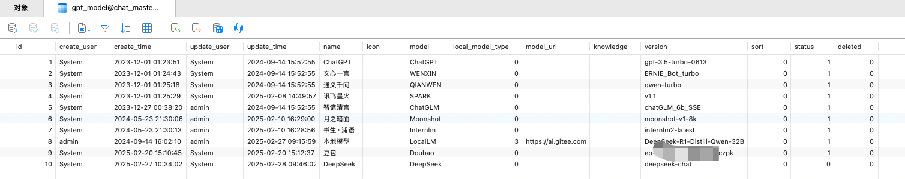
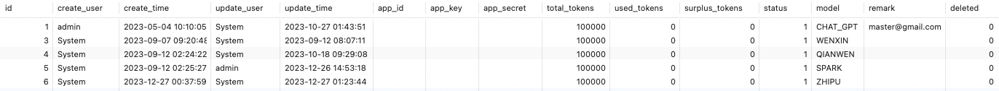
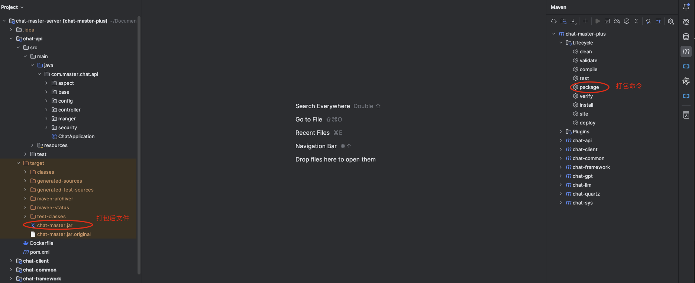

# Chat MASTER
# 本地部署方式问题汇总
- 后台管理系统默认密码为 admin 123456


- 客户端账号密码自行注册，登录即注册

## docker安装好：mysql8.0和redis
- redis默认没有密码
- mysql8.0这里注意：账号密码使用默认都是：chat_master
然后这里的数据库创建后，这里注意，分配账号权限：
8.0的账号权限分配：
```bash
授权 chat_master 的数据库权限：针对mysql8.0
GRANT ALL PRIVILEGES ON *.* TO 'chat_master'@'%' WITH GRANT OPTION;
```

## 项目功能分支说明
注意：官网文档：
[官网文档内容](https://www.yuque.com/panday94/ct0azl/ehxcgoy0xg41l9c3#IQmnv)

## 解决当前的chat-api的mysql的8.0的部署的账号密码远程权限基本可以了。
- 其他的配置不用修改
- 远程权限访问修改：
```bash
授权 chat_master 的数据库权限：针对mysql8.0
GRANT ALL PRIVILEGES ON *.* TO 'chat_master'@'%' WITH GRANT OPTION;

```

### 解决mysql的账号和远程连接后，密码错误的问题
这个和docker镜像配置mysql的权限有关

● chat-master-server java服务项目，技术采用Java8 + Mysql5.7 + Redis
● chat-master-admin 后台管理项目，技术采用vue2 + Element UI
● chat-master-web 网页端项目，技术采用vue3 + TypeScript + NaiveUI + Tailwind
● chat-master-uniapp 移动端项目，采用Uniapp进行开发，支持将项目打包成H5、小程序、Android及iOS


## 后端项目：chat-master-server
部署说明
本地开发
使用 IDEA 导入文件夹 chat-master/chat-master-server 目录。

### 第一步、修改配置文件
修改spring.profiles.active=dev
本地开发
使用 IDEA 导入文件夹 chat-master/chat-master-server 目录。
第一步、修改配置文件

修改spring.profiles.active=dev

```
# 注意检查环境
spring:
  # 环境 dev|test|prod
  profiles:
    active: dev
```

### 第二步：将application-dev.yml 的 Mysql、Redis 的配置信息修改为自己的

```
spring:
  # 缓存
  redis:
    open: true  # 是否开启redis缓存  true开启   false关闭
    database: 0
    host: 127.0.0.1
    port: 6379
    password:  # 密码（默认为空）
    timeout: 6000  # 连接超时时长（毫秒
    lettuce:
      pool:
        max-active: 1000  # 连接池最大连接数（使用负值表示没有限制）
        max-wait: -1      # 连接池最大阻塞等待时间（使用负值表示没有限制）
        max-idle: 10      # 连接池中的最大空闲连接
        min-idle: 5       # 连接池中的最小空闲连接
  #指定数据源
  datasource:
    type: com.alibaba.druid.pool.DruidDataSource
    #多数据源配置
    dynamic:
      primary: master
      strict: false #严格匹配数据源,默认false. true未匹配到指定数据源时抛异常,false使用默认数据源
      datasource:
        # 数据库1
        master:
          driver-class-name: com.mysql.jdbc.Driver
          url: jdbc:mysql://127.0.0.1:3306/chat_gpt?useUnicode=true&characterEncoding=utf8&zeroDateTimeBehavior=convertToNull&useSSL=false&serverTimezone=GMT%2B8
          username: root
          password: 123456
        # 数据库2
        slave_1:
          driver-class-name: com.mysql.jdbc.Driver
          url: jdbc:mysql://127.0.0.1:3306/chat_gpt?useUnicode=true&characterEncoding=utf8&zeroDateTimeBehavior=convertToNull&useSSL=false&serverTimezone=GMT%2B8
          username: root
          password: 123456
```
### 第三步、执行sql

● 执行chat-master-server/sql/chat-master.sql即可
● 如升级时有必要的话检查一下update.sql中最新的sql语句，确认是否需要执行。

### 第四步、替换model表中的模型版本version字段或在后台配置


第五步、替换openkey表中的模型app_key信息或在后台配置



### 第六步、启动ChatApplication中的main方法

```
# 输出到这启动完成
Started ChatApplication in 7.21 seconds (JVM running for 8.124)
```


### 打包项目说明：
这里使用idea编辑器进行打包，如使用其他编辑器需自行百度，打包后的文件为chat-api/target/chat-master.jar
⚠️ 此处需要注意你是使用dev环境还是test环境还是prod（生产）环境，部署以dev环境示例。


注意：官网文档：
[官网文档内容](https://www.yuque.com/panday94/ct0azl/ehxcgoy0xg41l9c3#IQmnv)


### 项目java导入的时候，注意：配置IDE的当前的JDK
版本需要时：jdk8

同时使用jenv管理jdk版本，注意切换jdk版本。

### 找到chat-api项目，启动
启动后：访问端口：
- 同时，通过对应的chat-master-web项目，这里访问即可测试。


> 声明：此项目发布于码云、GitCode和GitHub，基于 Apache 协议，免费且作为开源学习使用，禁止转卖、谨防受骗。如需商用必须保留版权信息，请自觉遵守。确保合法合规使用，在运营过程中产生的一切任何后果自负，与作者无关。


# 项目简介和部署说明地址：
- 部署相关文件在[deploy](deploy)

ChatMASTER，基于AI大模型api实现的自建后端对话服务，支出同步响应及流式响应，完美呈现打印机效果。支持一键切换DeepSeek(支持满血版R1模型)、月之暗面（Kimi）、豆包、OpenAI、Claude3、文心一言、通义千问、讯飞星火、智谱清言(ChatGLM)、书生浦语等主流模型，并且支持使用Ollama和Langchain进行加载本地模型及知识库问答，同时支持扣子(Coze)、Dify、Gitee AI（模力方舟）、FastGPT等在线api接口，LinkAI对接中。

> 项目包含java服务端、网页端、移动端及管理后台配置。Java服务端master分支默认使用Jdk8，SpringBoot3分支使用Jdk17/20，[SpringBoot3](https://gitee.com/panday94/chat-master/tree/springboot3)

> 项目基于后台管理系统配置密钥模型相关信息，无需配置配置文件。

> 如果觉得项目好用，请点个Star吧！如需ChatGPT或者Claude支持，可[联系作者](#联系我们)获取。如期待更多模型支持，欢迎提交Issues👏

> 移动端项目暂未开源，若需要及商业版，可[联系作者](#联系我们)获取。

> 开发文档 [ChatMASTER](https://www.yuque.com/panday94/ct0azl/ehxcgoy0xg41l9c3)

> 支持 [一键部署](./deploy/deploy.md)


GitHub直通车[点我传送](https://github.com/panday94/chatgpt-master)

欢迎小伙伴或有合作意向一起加入交流群[添加微信](#扫码进群)或提Issues。使用参考下面具体介绍：

* 支持一键切换DeepSeek R1、月之暗面（Kimi）、豆包、ChatGPT(3.5、4.0)、Claude3、文心一言、通义千问、讯飞星火、智谱清言(ChatGLM)、书生浦语、腾讯混元等主流模型。
* 不仅支持国内外官方模型接口，并且支持使用[Ollama](https://ollama.com/)、[Langchain-chatchat](https://github.com/chatchat-space/Langchain-Chatchat)加载本地模型调用，同时支持[扣子(Coze)](https://www.coze.cn/home)、[Gitee AI（模力方舟)](https://ai.gitee.com/)、[Dify](https://cloud.dify.ai/explore/apps)、[FastGPT](https://cloud.fastgpt.cn/)、[RagFlow](https://ragflow.io/)等在线api接口，[LinkAI](https://link-ai.tech/home)对接中。
* 免费提供多种类型助手按指定prompt输出，也可在管理后台创建自定义助手模版。如需更多万花筒信息可关注公众号[扫码获取](#联系我们)获取.
* 提供深度思考及联网搜索能力，支持Coze、Dify、FastGPT多智能体/工作流对接，同时支持文档对话。
* 管理端端采用Vue2、Element UI，ChatMASTER网页端使用Vue3、TypeScript、NaiveUI进行开发。
* 服务端采用Spring Boot、Spring Security + JWT、Mybatis-Plus、Lombok、 Mysql & Redis，代码通俗易懂，上手即用。
* 完善的权限控制，权限认证使用Jwt，支持多终端认证系统。
* 扫码加入微信群免费获取部署教程[扫码加入](#扫码进群)。

* 阿里云折扣场：[点我进入](https://www.aliyun.com/minisite/goods?userCode=iqguofg4)，腾讯云秒杀场：[点我进入](https://curl.qcloud.com/11y0ob0f)&nbsp;&nbsp;
* 阿里云优惠券：[点我领取](https://www.aliyun.com/daily-act/ecs/activity_selection?userCode=iqguofg4)，腾讯云优惠券：[点我领取](https://curl.qcloud.com/EUbjrCcu)&nbsp;&nbsp;


## 已实现功能
1. 支持后台配置大模型信息及模型版本信息，同时支持配置模型密钥信息
2. 支持后台配置assistant助手模版，按指定prompt输出
3. 支持vip及svip功能，支持兑换码、分享功能，集成微信支付，支持普通商户支持及服务商支付
4. 支持个人信息修改，支持个人用户账号禁用功能
5. 支持按使用次数或者开通会员使用，也可全局判断不校验使用次数及会员，电量赠送次数或者不校验电量可在[chat-master-admin](#)中进行配置
6. 支持配置网站信息，支持对接GPT代理地址及本地代理，支持配置微信公众号、小程序及微信支付信息，支持腾讯oss/sms和阿里云oss/sms
7. 移动端websocket支持
8. 支持文档/图片对话

## 待实现功能
1. MJ/SD
2. 语音对话
3. 视频生成

## 模型功能对比

> 版本记录请查看这里[版本记录](./CHANGELOG.md)

提示：
1. ChatGPT 可通过`Cloudflare`访问openai接口或者使用代理，ChatGPT及国内模型密钥由后台系统配置，如需代理可[联系作者](#联系我们)获取。

| 名称                                          | 免费？ | 是否国内     | 地址 |
| --------------------------------------------- | ------ | ---------- | ---- |
| ChatGpt                          | 否     | 否       | https://chat.openai.com/ |
| 文心一言 | 否     | 是 | https://yiyan.baidu.com/ |
| 通义千问 | 否     | 是 | https://tongyi.aliyun.com/ |
| 讯飞星火 | 否     | 是 | https://xinghuo.xfyun.cn/ |
| 智谱清言 | 否     | 是 | https://chatglm.cn/ |
| 月之暗面 | 否     | 是 | https://kimi.moonshot.cn/ |
| 书生浦语 | 否     | 是 | https://internlm-chat.intern-ai.org.cn/ |
| 豆包 | 否     | 是 | https://www.doubao.com/ |
| DeepSeek | 否     | 是 | https://chat.deepseek.com/ |

## 内置功能
1. 工作台：集成多个应用和功能的系统页面，该页面主要为用户提供快速访问、信息聚合、个性化等功能。
2. 数据中心：用于管理和分析系统数据的功能，向用户提供直观和易懂的信息，方便使用者快速了解系统数据。
3. 任务中心：可以后台查看模型聊天对话记录及绘画任务记录。
4. 订单管理：查看开通会员订单信息及退款操作。
5. 会员中心：查看所有用户信息，及开通模型次数及消耗电量统计功能。
6. 模型管理：配置大模型及模型版本信息和模型密钥信息。
7. 助手中心：配置Assistant分类及prompt信息。
8. 应用管理：包含内容管理及站点配置
    - 内容管理：用户协议、隐私协议编辑修改，如有需要可增加其他内容
    - 站点配置：基础信息、应用信息、微信信息、oss/sms信息。
        - 基础信息：站点名称、站点logo、配置ChatGPT代理、站点版权、站点描述
        - 应用信息：是否限制访问GPT、是否开启兑换码、是否开启注册短信、是否分享获取电量、注册赠送电量、移动端首页公告
        - 微信信息：包含小程序、公众号、商户号信息等
        - oss/sms信息：配置文件上传及短信密钥
9. 系统管理：对系统中基础业务进行管理维护。

## 模块介绍

| 模块              | 备注  | 
|----------------- |---------------- |
| chat-master-admin   | 管理端代码 （Vue2）         |
| chat-master-server    | 后端服务代码（Java） | 
| chat-master-uniapp    | 移动端Uniapp代码，支持App、小程序、H5 （暂未开源，若需要及商业版，可[联系作者](#联系我们)获取）   |
| chat-master-web    | Web端代码（Vue3）    |

## 💡环境搭建/运行/部署
1. [部署运行教程](./deploy/deploy.md)
2. [常见问题](./doc/常见问题.md)

## 参与贡献

贡献之前请先阅读 [贡献指南](./CONTRIBUTING.md)

个人的力量始终有限，任何形式的贡献都是欢迎的，包括但不限于贡献代码，优化文档，提交 issue 和 PR 等。
感谢所有做过贡献的人!

## 赞助

如果你觉得这个项目对你有帮助，并且情况允许的话，可以给我一点点支持，总之非常感谢支持～

<div style="display: flex; gap: 20px;">
	<div style="text-align: center">
		
		<p>WeChat Pay</p>
	</div>
</div>

## 联系我们
<div style="display: flex;">
    
</div>

## 扫码进群
<div style="display: flex; gap: 20px;">
    
</div>

## 许可证

[Apache License 2.0](./LICENSE)

Copyright (c) 2023 熊扬软件开发工作室 Limited All rights reserved